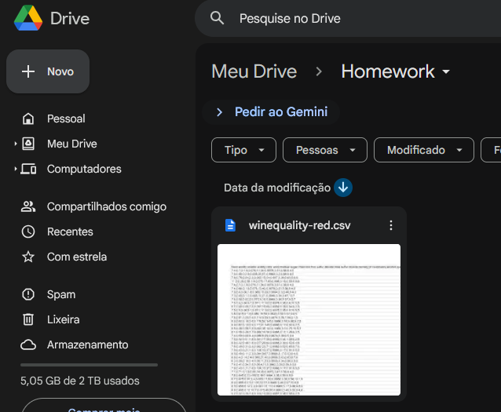

# HW1-ICA: Wine Quality
EQUIPE:
- Marina Vasques Rodrigues (496500): Descrição dos dados e Análise Univariada Incondicional
- Fábio Gabriel Esteves Ivo Gomes (510514): Análise Multivariada Incondicional
- Caio Vinícius Pessoa Freires (558169): Análise Univariada Condicional por Classe
- Fábio Agostinho da Silva Nascimento Filho (538521): Análise Bivariada Incondicional

  
LINK OVERLEAF: https://www.overleaf.com/read/cvxtzhhvjbkg#dcad73   
LINK GOOGLE COLAB (Rodar o código ipynb online): https://colab.research.google.com/drive/1TyMrC0-78rmzAeob8kWr5yqnDrbvajbO?usp=sharing

## Como executar o código

A maneira mais fácil de rodar o código é online utilizando o link do google colab, que vai permitir executar todo o código em python somente com um clique do botão "Run all" na parte superior esquerda da tela.   
É necessário no entanto criar uma pasta Homework na raiz do google drive contendo winequality-red.csv. Da forma `/content/drive/MyDrive/Homework/winequality-red.csv`

